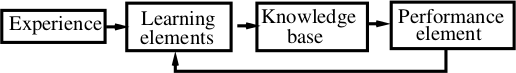

CS36110 Machine Learning
========================

Should really be known as Intelligent Learning.

Taught by:

* Younghuai Lio (yyl)
* Chuan Lu (cul)

Occam's Razor states that simple solutions tend to be better, however there are complex problem to which a simple solution simply isn't possible. Intelligent learning is the tool we use to help solve these complex problems.

> "Nothing is certain in this world other than death and taxes."

Experience is defined as an input-output pair, to which the input is the environment and the output is the decision.

What is Learning?
-----------------

A learning system is a computer program that makes decisions based on the accumulated experience contained in successfully solved cases.

Learning is improving performance $P$ with experience $E$ at some task $T$.

A Learning Model
----------------

Representation
--------------

Training Experience $<input, output>$

The $input$ consists of a pattern (input vector, patter vector, feature vector, sample, example or instance) of observations and the corresponding correct outputs.

Each attribute can take one of three types of value:

* Real Value
* Discrete Value
* Categorical Value

The $output$ can take two types of value:

* It may be a real number, in which case the learning algorithm is know as a function estimator, the $output$ is called an output value or estimate.
* It may be a categorical value, in which case the learning algorithm is known as a classifier, a recogniser or a categoriser, and the $output$ itself is a label, a class, a category or a decision.

If the $output$ is given the learning is known as **supervised**, otherwise it is **unsupervised**.

Target Functions
----------------

The relationship $f$ between the learning inputs $x$ and outpus $y$ is:

$$
y = f(x)
$$

In practice we have no idea what $f$ actually is, but we can make an assumption about what $f$ looks like with a hypothesis $h$.

$h$ will be learned from the training examples and some sort of algorithm.

Learning as Regression
----------------------

Given experience: $<input, output>(i=1,2,...)$

Define a target function $h: input \rightarrow output$

Choose learning criterion: The target function should best fit the experience.

Optimise the objective function:

$$
min_h\sum_i(\overset{\^}{output_i} - output_i)^2
$$

**In English:** Minimise $h$ for the squared distance between the output of $h(x_i)$ and $y_i$ of all examples.

Performance Measurement
-----------------------

$$
\text{Error Rate} = \frac{\text{Number of Errors}}{\text{Number of Examples}}
$$

